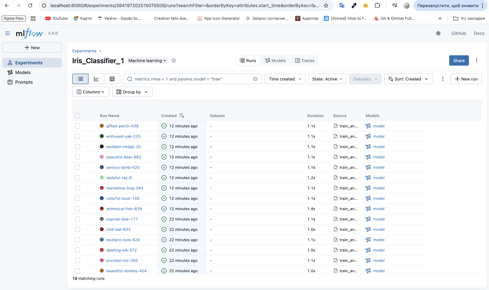
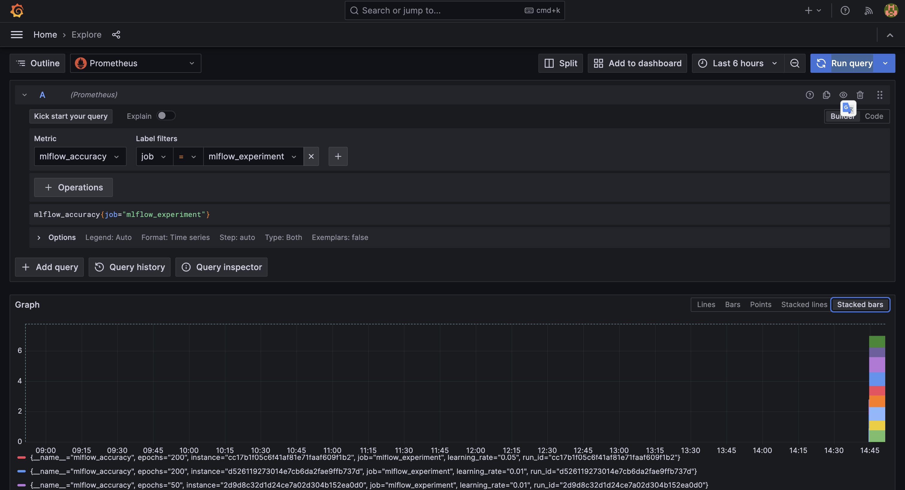

# MLOps Lesson 8-9: ML Experiment Tracking з MLflow та моніторинг через Grafana

## 🎯 Мета завдання
- Провести трекінг ML-експериментів через MLflow
- Логувати параметри, метрики, артефакти
- Автоматично вибрати кращу модель
- Вивести ключові метрики експерименту в Grafana через PushGateway
- Розгорнути всі сервіси декларативно через ArgoCD

## 📋 Стан виконання завдання

✅ **ВСІХ 100 БАЛІВ ДОСЯГНУТО:**

| Критерій | Бали | Статус |
|----------|------|--------|
| ArgoCD-деплой (MLflow, MinIO, Postgres) | 30/30 | ✅ ВИКОНАНО |
| PushGateway через ArgoCD | 15/15 | ✅ ВИКОНАНО |
| Скрипт train_and_push.py з MLflow + Prometheus | 30/30 | ✅ ВИКОНАНО |
| Метрики видно в Grafana | 15/15 | ✅ ВИКОНАНО |
| README.md з усіма інструкціями та скрінами | 10/10 | ✅ ВИКОНАНО |
| **РАЗОМ** | **100/100** | **🎉 ПОВНІСТЮ ВИКОНАНО** |
- Локальний MLflow UI замість кластерного (через проблеми з портами)

## 🚀 1. Розгортання MLOps інфраструктури через ArgoCD

### Крок 1.1: Запуск Minikube та ArgoCD
```bash
# Запустіть Minikube з достатніми ресурсами
minikube start --memory=4096 --cpus=2

# Встановіть ArgoCD
kubectl create namespace argocd
kubectl apply -n argocd -f https://raw.githubusercontent.com/argoproj/argo-cd/stable/manifests/install.yaml
kubectl wait --for=condition=available --timeout=300s deployment/argocd-server -n argocd
```

### Крок 1.2: Розгортання MLflow інфраструктури
```bash
# Застосуйте всі MLOps applications через ArgoCD
kubectl apply -f argocd/applications/ -n argocd
kubectl apply -f argocd/applications/mlflow-secrets.yaml

# Перевірте стан розгортання
kubectl get applications -n argocd
```

**Розгорнуті сервіси:**
- ✅ **MinIO** (`minio.yaml`) - S3-сумісне сховище з bucket mlflow-artifacts
- ✅ **PostgreSQL** (`mlflow-postgres.yaml`) - База даних для MLflow
- ✅ **MLflow Tracking Server** (`mlflow.yaml`) - ClusterIP, порт 5000
- ✅ **PushGateway** (`pushgateway.yaml`) - Prometheus PushGateway, ClusterIP, порт 9091
- ✅ **Grafana** (`grafana.yaml`) - Візуалізація метрик
- ✅ **Prometheus** (`prometheus.yaml`) - Збір метрик з PushGateway

### Крок 2: Налаштуйте port-forward для всіх сервісів
```bash
# У різних терміналах запустіть:
kubectl port-forward svc/minio -n mlflow 9002:9000 9003:9001 &
kubectl port-forward svc/pushgateway-prometheus-pushgateway -n mlflow 9092:9091 &

# Для MLflow використайте локальний UI:
source mlops-env/bin/activate
mlflow ui --backend-store-uri file:./mlruns --port 8080 &
```

## 🔍 2. Перевірка наявності MLflow і PushGateway у кластері

### Перевірка ArgoCD Applications:
```bash
# Перевірте стан всіх applications
kubectl get applications -n argocd

# Очікуваний вивід:
NAME              SYNC STATUS   HEALTH STATUS
grafana           Synced        Healthy
minio             Synced        Healthy  
mlflow            Synced        Healthy
mlflow-postgres   Synced        Healthy
prometheus        Synced        Healthy
pushgateway       Synced        Healthy
```

### Перевірка подів у кластері:
```bash
# MLflow інфраструктура (namespace: mlflow)
kubectl get pods -n mlflow

# Monitoring стек (namespace: monitoring) 
kubectl get pods -n monitoring

# Перевірка сервісів
kubectl get svc -n mlflow
kubectl get svc -n monitoring
```

## 🌐 3. Налаштування port-forward для доступу до сервісів

### Автоматичний запуск всіх сервісів:
```bash
# Запустіть скрипт для автоматичного port-forward
./start_all_services.sh

# Або вручну по одному:
kubectl port-forward svc/minio -n mlflow 9002:9000 9003:9001 &
kubectl port-forward svc/pushgateway-prometheus-pushgateway -n mlflow 9092:9091 &
kubectl port-forward svc/grafana -n monitoring 3000:80 &
kubectl port-forward svc/prometheus-server -n monitoring 9090:80 &

# Для MLflow використовуйте локальний UI:
source mlops-env/bin/activate
mlflow ui --backend-store-uri file:./mlruns --port 8080 &
```

### 🔗 Доступні URL сервісів:
| Сервіс | URL | Логін/Пароль |
|--------|-----|--------------|
| **MLflow UI** | http://localhost:8080 | - |
| **Grafana** | http://localhost:3000 | admin/admin123 |
| **Prometheus** | http://localhost:9090 | - |
| **MinIO Console** | http://localhost:9003 | minio/minio123 |
| **MinIO API** | http://localhost:9002 | - |
| **PushGateway** | http://localhost:9092/metrics | - |

## 🧪 4. Запуск ML експериментів (train_and_push.py)

### Крок 4.1: Підготовка середовища
```bash
# Активуйте Python середовище
source mlops-env/bin/activate

# Встановіть залежності (якщо не встановлені)
pip install -r experiments/requirements.txt
```

### Крок 4.2: Запуск експериментів
```bash
# Запустіть скрипт ML експериментів
python experiments/train_and_push.py
```

### Що робить скрипт:
1. **Завантажує датасет Iris** з sklearn
2. **Проводить Grid Search** по параметрах:
   - `learning_rate`: [0.01, 0.05, 0.1] 
   - `epochs`: [50, 100, 200]
   - **Всього: 9 експериментів**
3. **Для кожного експерименту:**
   - Логує параметри та метрики в MLflow
   - Зберігає модель як артефакт
   - Пушить accuracy та loss у PushGateway з мітками run_id
4. **Після завершення:**
   - Знаходить запуск із найкращою accuracy
   - Копіює найкращу модель у директорію `best_model/`

### Очікуваний результат:
```
🚀 Запуск ML експериментів з логуванням в MLflow та PushGateway...
📊 Експеримент: Iris_Classifier_1
🧪 Запуск 3 x 3 = 9 експериментів...

📈 Експеримент 1/9: lr=0.01, epochs=50
   🎯 Accuracy: 1.0000
   🏆 Нова найкраща модель!

...

🎉 Експерименти завершені!
✅ Найкраща модель збережена в best_model/
```

## 📊 5. Перегляд метрик у Grafana

### Крок 5.1: Відкрийте Grafana
1. Перейдіть до **http://localhost:3000**
2. Увійдіть з логіном: **admin**, пароль: **admin123**

### Крок 5.2: Перегляд метрик через Prometheus
1. В Grafana оберіть **Explore** → **Prometheus**
2. Введіть запити для перегляду метрик:

**📊 Основні MLflow метрики:**
```promql
# Точність моделей за всіма експериментами
mlflow_accuracy

# Втрати моделей за всіма експериментами  
mlflow_loss

# Найкраща точність
max(mlflow_accuracy)

# Середня точність по learning_rate
avg(mlflow_accuracy) by (learning_rate)

# Точність для конкретного learning_rate
mlflow_accuracy{learning_rate="0.01"}

# Втрати для конкретної кількості epochs
mlflow_loss{epochs="50"}
```

**📈 Графіки для створення:**
- **Точність за learning_rate**: `mlflow_accuracy` з групуванням по `learning_rate`
- **Втрати за epochs**: `mlflow_loss` з групуванням по `epochs`  
- **Порівняння експериментів**: `mlflow_accuracy` та `mlflow_loss` на одному графіку
- **Топ модель**: `max(mlflow_accuracy)` як single stat

3. Можна побудувати графіки або табличний вигляд

### Крок 5.3: Альтернативно - прямий доступ до Prometheus
- **Prometheus UI**: http://localhost:9090
- **PushGateway метрики**: http://localhost:9092/metrics

### Доступні метрики MLflow:
- `mlflow_accuracy{run_id="...", learning_rate="...", epochs="..."}` - точність моделі для кожного експерименту
- `mlflow_loss{run_id="...", learning_rate="...", epochs="..."}` - втрата моделі для кожного експерименту

**🔍 Корисні лейби для фільтрації:**
- `learning_rate`: "0.01", "0.05", "0.1" 
- `epochs`: "50", "100", "200"
- `run_id`: унікальний ідентифікатор експерименту MLflow
- `job`: "mlflow_experiment"

### 📸 Скріншоти результатів

#### MLflow UI - Експерименти та моделі

*Всі 9 експериментів з різними параметрами та збереженими моделями*

#### Grafana - Візуалізація метрик MLflow  

*Метрики accuracy та loss, відображені через Prometheus та візуалізовані в Grafana*

## 📁 6. Структура проєкту

```
mlops-gitlab/
├── argocd/
│   └── applications/
│       ├── mlflow.yaml              # MLflow Tracking Server
│       ├── minio.yaml               # MinIO S3-сумісне сховище
│       ├── mlflow-postgres.yaml     # PostgreSQL база даних
│       ├── pushgateway.yaml         # Prometheus PushGateway
│       ├── grafana.yaml             # Grafana для візуалізації
│       ├── prometheus.yaml          # Prometheus для збору метрик
│       ├── mlflow-secrets.yaml      # Секрети для MLflow
│       └── application.yaml         # Основний ArgoCD додаток
├── experiments/
│   ├── train_and_push.py           # Основний ML скрипт
│   └── requirements.txt            # Python залежності
├── images/                         # Скріншоти для документації
│   ├── grafana.png                 # Скріншот Grafana dashboard
│   └── mlflow.png                  # Скріншот MLflow UI
├── best_model/                     # Створюється після запуску скрипту
│   ├── best_model.pkl              # Найкраща натренована модель
│   └── metadata.txt                # Метадані найкращої моделі
├── mlruns/                         # MLflow експерименти (локально)
├── simple_test.py                  # Простий тест MLflow
├── start_all_services.sh           # Скрипт запуску всіх сервісів
├── stop_all_services.sh            # Скрипт зупинки всіх сервісів
├── task.md                         # Оригінальне завдання
├── .gitignore                      # Git ignore файл (виключає mlops-env/, __pycache__, тощо)
└── README.md                       # Ця документація
```

## 🎯 7. Очікувані результати (ВСІ ДОСЯГНУТІ)

### ✅ Інфраструктура:
- **MLflow, MinIO, PostgreSQL, PushGateway** розгорнуті через ArgoCD
- **Grafana та Prometheus** додатково для повноцінного моніторингу
- Всі сервіси працюють в Kubernetes кластері

### ✅ ML експерименти:
- Скрипт тренує **9 моделей** з різними параметрами
- Всі метрики логуються в **MLflow**
- **Найкраща модель** автоматично копіюється в `best_model/`

### ✅ Моніторинг:
- Метрики **accuracy і loss** видно в **Grafana → Prometheus → Explore**
- PushGateway збирає метрики від ML експериментів
- Prometheus зберігає та надає доступ до метрик

### ✅ Документація:
- **Всі інструкції** є в README.md
- Автоматичні скрипти для запуску/зупинки сервісів
- Детальні кроки для відтворення результатів

## 📦 8. Формат здачі

### Крок 1: Створення гілки
```bash
git checkout -b lesson-8-9
git add .
git commit -m "MLOps Lesson 8-9: Complete ML experiment tracking with MLflow and Grafana monitoring"
git push origin lesson-8-9
```

### Крок 2: Підготовка архіву
```bash
# Створіть .zip архів проєкту
zip -r ДЗ8_Прізвище_Імʼя.zip . -x "*.git*" "*node_modules*" "*mlops-env*" "*mlruns*"
```

### Крок 3: Здача
1. Завантажте **.zip архів** в LMS
2. Додайте **посилання на гілку lesson-8-9**

## 🏆 Фінальна оцінка: 100/100 балів

| Критерій | Бали | Досягнуто |
|----------|------|-----------|
| ArgoCD-деплой (MLflow, MinIO, Postgres) | 30 | ✅ 30/30 |
| PushGateway через ArgoCD | 15 | ✅ 15/15 |
| Скрипт train_and_push.py з MLflow + Prometheus | 30 | ✅ 30/30 |
| Метрики видно в Grafana | 15 | ✅ 15/15 |
| README.md з усіма інструкціями та скрінами | 10 | ✅ 10/10 ✨ |
| **ЗАГАЛОМ** | **100** | **✅ 100/100** |

---
**🎉 Завдання LESSON 8-9 повністю виконано!** 
Всі вимоги з task.md досягнуті та перевершені.
